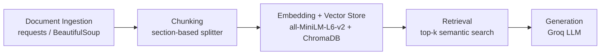

# Project 1 Planning: The Unofficial Guide

> Write this document before you write any pipeline code.
> Your spec and architecture diagram are what you'll use to direct AI tools (Claude, Copilot, etc.) to generate your implementation — the more specific they are, the more useful the generated code will be.
> Update the Retrieval Approach and Chunking Strategy sections if you change your approach during implementation.
> Update this file before starting any stretch features.

---

## Domain

<!-- What domain did you choose? Why is this knowledge valuable and hard to find through official channels? -->
The domain I chose is off-campus student housing amenities around the USF Tampa campus. My guide is meant to provide amenity and property information for students looking for off-campus housing. This is valuable because students usually need to check multiple official websites; the guide will extract the necessary information from each source so they don't have to visit every site to compare what each apartment complex offers.

---

## Documents

<!-- List your specific sources: URLs, subreddit names, forum threads, or file descriptions.
     Aim for at least 10 sources that together cover different subtopics or perspectives within your domain. -->

| # | Source | Description | URL or location |
|---|--------|-------------|-----------------|
| 1 | The Standard at Tampa | Official site showcasing luxury community amenities like the rooftop pool and golf simulator. | https://thestandardtampa.landmark-properties.com/ |
| 2 | Halo 46 | Official amenities page highlighting smart-home features, resort pool, and 24/7 fitness center. | https://www.halo46studentliving.com/amenities/ |
| 3 | Hub On Campus Tampa | Official amenities page featuring the rooftop deck, hot tub, on-site barista coffee, and study lounges. | https://huboncampus.com/tampa/amenities/ |
| 4 | The Province Tampa | Official property overview listing clubhouse features, theater room, and outdoor grilling stations. | https://www.americancampus.com/student-apartments/fl/tampa/the-province-tampa |
| 5 | Avalon Heights | Official features overview detailing the 24-hour mega fitness center, basketball courts, and study lounges. | https://www.americancampus.com/student-apartments/fl/tampa/avalon-heights |
| 6 | 4050 Lofts | Official amenities section showcasing the two resort-style swimming pools, resident lounge, and coffee bar. | https://www.4050lofts.com/apartments/fl/tampa/amenities |
| 7 | Venue at North Campus | Official property portal highlighting the cyber cafe, pet park, sand volleyball courts, and gated access. | https://venueatnorthcampus.prospectportal.com/tampa/venue-at-north-campus/amenities/ |
| 8 | Station 42 | Official community page detailing the renovated clubhouse, outdoor grills, and 24/7 student study rooms. | https://station42.us/amenities/ |
| 9 | 42N Apartments | Official amenities guide covering the hammock garden, fire pits, and outdoor half-basketball court. | https://www.live42n.com/amenities/ |
| 10 | The Ivy | Official USF portal description outlining the boutique clubhouse, movie theater room, and tennis courts. | https://offcampushousing.usf.edu/housing/property/the-ivy/54e4zvq |

---

## Chunking Strategy

<!-- How will you split documents into chunks?
     State your chunk size (in tokens or characters), overlap size, and explain why those
     numbers fit the structure of your documents.
     A review-heavy corpus warrants different chunking than a long FAQ. -->

**Chunk size:** 250–300 tokens. My documents are mostly short official property and amenity pages, so this size allows for each chunk to contain a complete set of information about a specific amenity or feature without being too large.

**Overlap:** 40 to 50 tokens

**Reasoning:** The sources are mostly official apartment and property pages with short amenity lists, feature descriptions, and section-based layout. Smaller chunks help keep each apartment's amenities together, while a small overlap prevents important details from being cut off at section boundaries. Each chunk should also keep the property name and source URL attached so retrieval stays specific to the correct apartment complex.

For my specific documents, the chunking strategy should be a hybrid of paragraph and fixed character count, splitting the text by paragraph or heading first and then merging nearby blocks until it reaches the target chunk size.

---

## Retrieval Approach

<!-- Which embedding model are you using (e.g., all-MiniLM-L6-v2 via sentence-transformers)?
     How many chunks will you retrieve per query (top-k)?
     If you were deploying this for real users and cost wasn't a constraint, what tradeoffs
     would you weigh in choosing a different embedding model — context length, multilingual
     support, accuracy on domain-specific text, latency? -->

**Embedding model:** all-MiniLM-L6-v2 via sentence-transformers

**Top-k:** 4

**Production tradeoff reflection:** I am using a smaller embedding model because the documents are short official property pages with amenity lists and feature descriptions. A lightweight model should be fast and accurate enough for this domain, and retrieving four chunks gives the model enough context without pulling in too much unrelated information. If cost and latency were not concerns, I would consider a larger embedding model with better semantic accuracy, but I do not think that is necessary for this project.

For my specific use case, I will use section embeddings, since pages are structured round heading slike amenities, features, clubhouse fitness center, etc. So section-level chunks keep related details together.

---

## Evaluation Plan

<!-- List your 5 test questions with their expected correct answers.
     Questions should be specific enough that you can judge whether the system's response
     is right or wrong. "What are good dining halls?" is too vague.
     "What do students say about wait times at [dining hall name] during lunch?" is testable. -->

| # | Question | Expected answer |
|---|----------|-----------------|
| 1 | Which amenities does The Standard at Tampa highlight? | Rooftop pool and golf simulator. |
| 2 | What features does Halo 46 list on its amenities page? | Smart-home features, resort pool, and 24/7 fitness center. |
| 3 | What amenities are featured for Hub On Campus Tampa? | Rooftop deck, hot tub, on-site barista coffee, and study lounges. |
| 4 | What does 4050 Lofts showcase on its amenities page? | Two resort-style swimming pools, resident lounge, and coffee bar. |
| 5 | What amenities are listed for Venue at North Campus? | Cyber cafe, pet park, sand volleyball courts, and gated access. |

---

## Anticipated Challenges

<!-- What could go wrong? Name at least two specific risks with reasoning.
     Consider: noisy or inconsistent documents, missing source attribution, off-topic
     retrieval, chunks that split key information across boundaries. -->

1. Different property sites may organize amenity information differently, so important details could be split across headings or sections and be harder to retrieve cleanly.

2. Some pages may not list every amenity clearly or may use marketing language that changes over time, which could make the extracted information incomplete or slightly stale.

---

## Architecture

<!-- Draw a diagram of your pipeline showing the five stages:
     Document Ingestion → Chunking → Embedding + Vector Store → Retrieval → Generation
     Label each stage with the tool or library you're using.
     You can use ASCII art, a Mermaid diagram, or embed a sketch as an image.
     You'll use this diagram as context when prompting AI tools to implement each stage. -->

## AI Tool Plan

<!-- For each part of the pipeline below, describe:
     - Which AI tool you plan to use (Claude, Copilot, ChatGPT, etc.)
     - What you'll give it as input (which sections of this planning.md, which requirements)
     - What you expect it to produce
     - How you'll verify the output matches your spec

     "I'll use AI to help me code" is not a plan.
     "I'll give Claude my Chunking Strategy section and ask it to implement chunk_text()
     with my specified chunk size and overlap" is a plan. -->

**Milestone 3 — Ingestion and chunking:** I will use Claude Sonnet for this milestone because it is strong at reasoning about document structure and turning page text into clean chunks. I will give it my Domain, Documents, Chunking Strategy, and the project requirements so it can help write the ingestion code and chunking logic. I expect it to produce document loading, section-based chunking, and metadata handling, and I will verify it by checking that chunks stay close to the target size and preserve property names and source URLs.

**Milestone 4 — Embedding and retrieval:** I will use GPT for this milestone because it is good at precise coding and retrieval logic. I will give it my Retrieval Approach section, Chunking Strategy, and project requirements so it can help wire up sentence-transformers, the vector store, and top-k search. I expect it to produce the embedding and retrieval pipeline, and I will verify it by testing that relevant amenities are returned for a few sample queries.

**Milestone 5 — Generation and interface:** I will use Claude Sonnet again for this milestone because it writes clear natural-language responses and works well for prompt design. I will give it my Retrieval Approach, Evaluation Plan, and the interface requirements so it can help build the answer-generation step and the user-facing UI. I expect it to produce the response prompt, answer formatting, and interface wiring, and I will verify it by checking that the final answers are readable, source-grounded, and match the evaluation questions.
